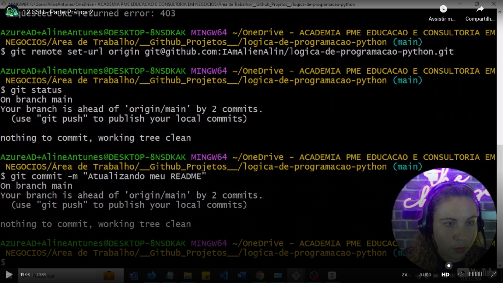
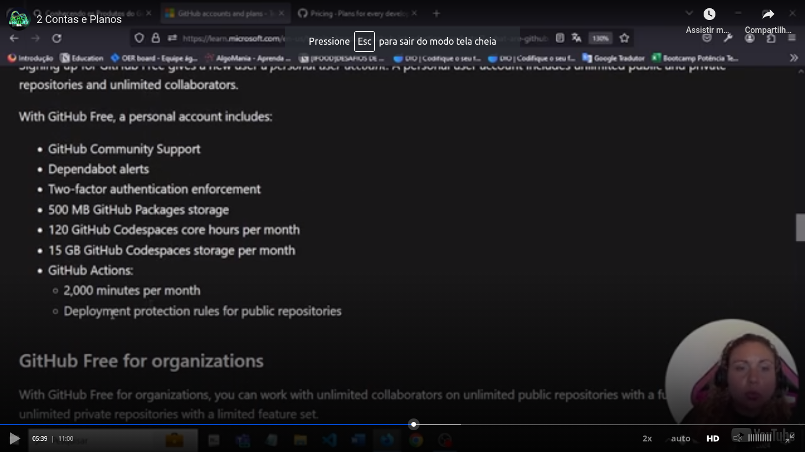
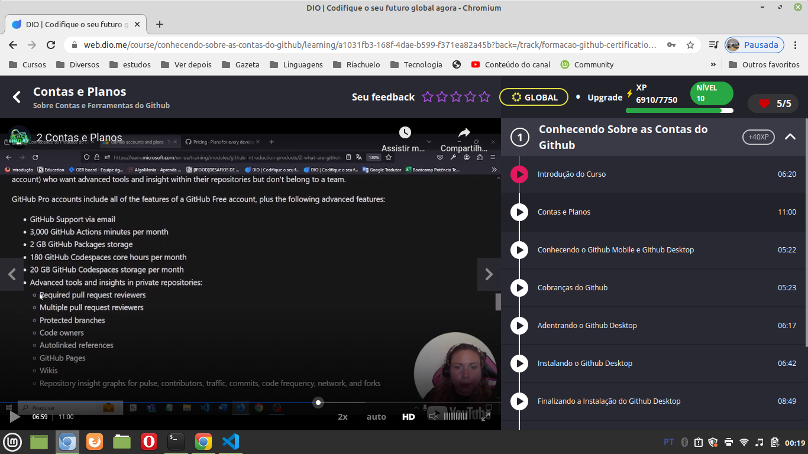
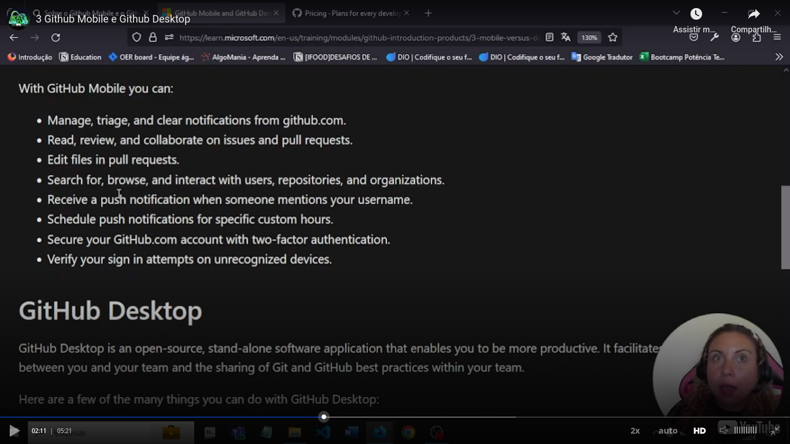
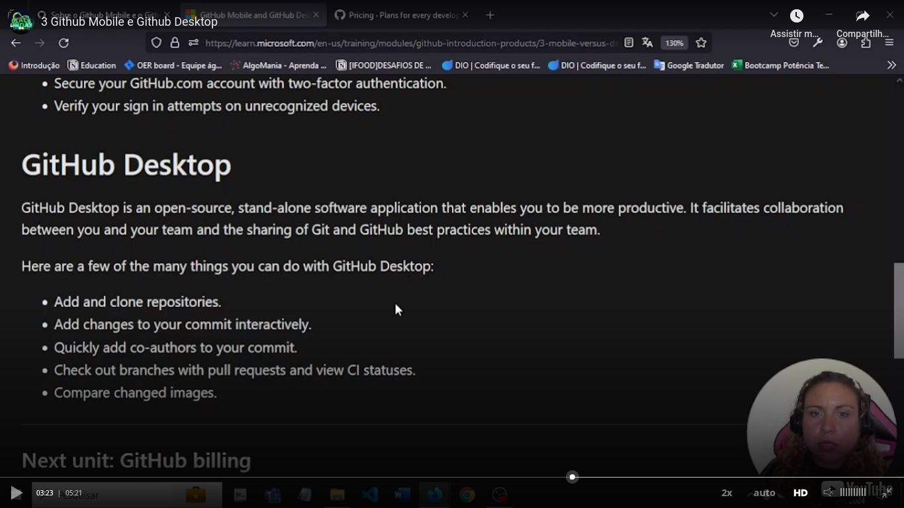
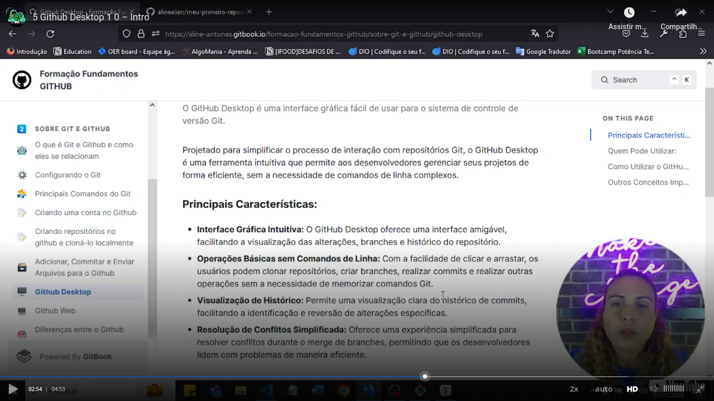
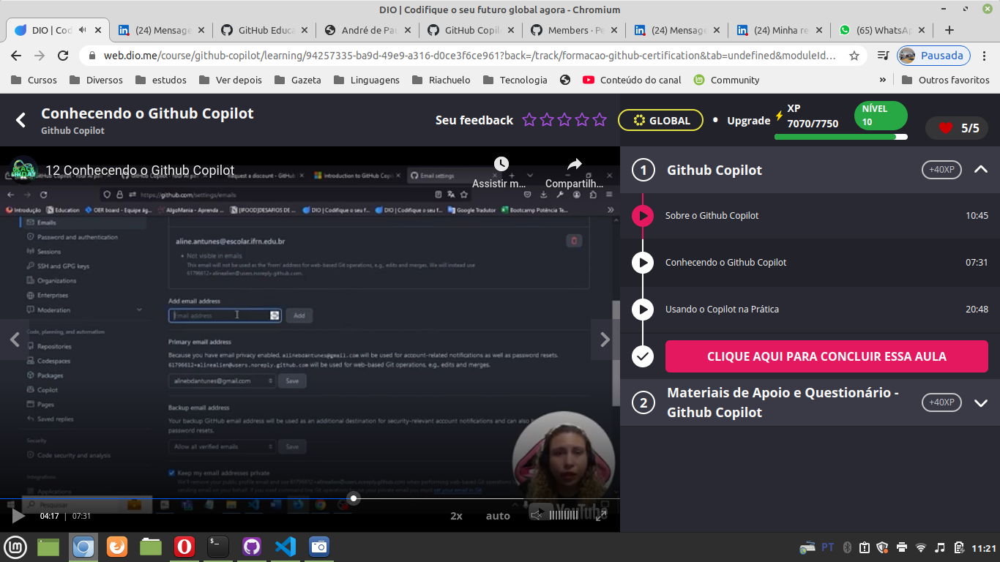
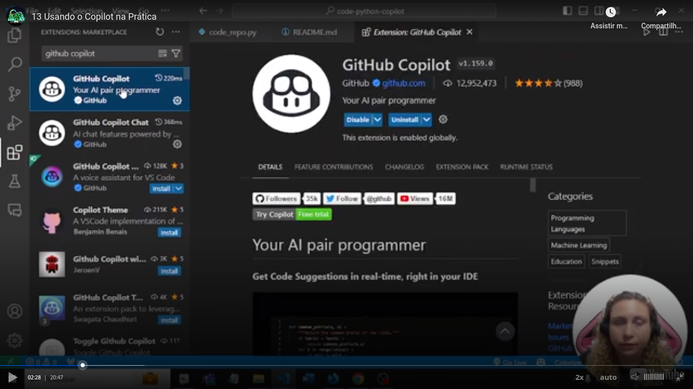

# DIO - Github Certification


## Important

[Link](https://www.dio.me/articles/certificacao-github-foundations-100-gratuita) talking about a free Github certification.

## Introduction

As I have some knowledge in Git, I will register here only some notes. As you can see [here](https://www.terceiro.com.br/git.html?nocache=1), I am teacher of a Git course in Udemy.


### git remote set url command

Teacher used a command doing the same thing that I know to do, but in a different way. To me is normal or:

- Clone the SSH address of the repository
- If the `HTTPS` address of the repository was cloned, is normal to me remove the `HTTPS` address and set the `SSH` address with the commands:

```
git remote rm origin
git remote add origin <ssh address>
```

I am considering that the person wanna register the addresses with the keyword `origin But the person, if want, can register with a different keyword. Example:

```
git remote add batatinha <ssh address>
```

But if the person do that, he/she will need to push using this keyword, like:

```
git push batatinha main
```

Supposing that the person wanna push to the branch main.

You can see here the command teacher used:



```
git remote set url <ssh-address>
```

After this command is only needed a simple `git push`.


### comparing "git branch -m" to "git branch -M"

I made [this video](https://youtu.be/luh0hxxJWoY) to explain the difference.


### git push -u origin master ("origin master" - both examples)

I made [this video](https://youtu.be/Qic96PMxTw4) talking about `git push` with the parameter `-u`.


### gi branch batatinha ("batatinha" is an example)

I used to create a branch and checkout it with the command ("batatinha" is an example of branch name):

```
git checkout -b batatinha
```

But is possible to only create a branch without passing to use it. This previous command creates a branch (as the following command) **and checkouts it** (the next command don't do it). The command to only create a branch is:

```
git branch batatinha
```

Remember, "batatinha" is only an example of a branch name.

The point in the tree of commits is the same in both cases, ok?


### Releases in Github

I explain in [this video](https://youtu.be/OWwOx51X8EM).


### Gists in Github

I created [this video](https://youtu.be/5FhYrjc4_EQ) to explain the concept.


### Issues in Github

I created [this video](https://youtu.be/r3ta36dhz8A) to explain the concept.


### Wiki in Github

I created [this video](https://youtu.be/Kh14BV8y4Vw) to explain the concept.


### A little comments about Markdown

> This way, with a ">" symbol, I can cite something.


### Github Emojis

Please see [this page](https://gist.github.com/roachhd/1f029bd4b50b8a524f3c).

Trying: :smile: (please see in Github)


### Adjusting the size of an image

Teacher explained how to adjust the size of an image. Instead using the Makdown syntax to add an image (``), you can insert with the HTML tag `img`, set the source of the image (normal, with the parameter `src`) and set the parameters `width` or `height` of the image (inside the tag img).


### Github stats

Teacher recomended [this link](https://github.com/anuraghazra/github-readme-stats).

There I got this code (with smal adjusts) to generate a stats card:

``


I made [this video](https://youtu.be/VU5lpIVE1Zc) about this question.


### Github accounts

There is three types of Github accounts:

- **Personal**: "normal" Github accounts when the subscription was made using a personal email;
- **Organization**: organizaion accounts are shared accounts where an unlimited number of people can colaborate across many projects a once. Permissions are done in a tiered approach. Each user log in in your own personal account and any actions the person takes on your account and their action will have effect on the organization, but tracked to a personal account;
- **Enterprise**: This type of account can have multiple organizations or teams.

An official Microsoft [training](https://learn.microsoft.com/en-us/training/paths/github-foundations/) about Github.

Resources related to a personal Github account:



Exists a free Github plan for organizations.

Resources related to a pro Github account:



Github pro and Github team has similar resources.

The focus of Github enterprise is in companies. It have more granular configuration related to security.

This plan have:

- Github Enterprise Server;
- Github Enterprise Cloud;

This plans have specifics number os limits of resources, like 50 GB limit to packages storage.

Summarizing:

Plan types:

- Personal;
- Organization;
- Enterprise.

Plans free and pro existing also for organizations.


### Capabilities of Github Mobile




### Capabilities of Github Desktop




### Github charges

Github charges may include:

- Subscriptpions;
- Paid products. Examples: Github Copilot and apps from the marketplace of Github.

There are also charges per use as example in the case of Github Actions (related to the time of the use).

[Link](https://docs.github.com/en/apps/github-marketplace/selling-your-app-on-github-marketplace/pricing-plans-for-github-marketplace-apps) about pricing related to Github marketplace apps.

[Capabilities and prices](https://github.com/pricing) related to subscription Github plans.

This page have a link to create a free organization.


### Github desktop

Main characteristics:



To install in Linux Mint I followed these instructions from [this link](https://gist.github.com/timohuovinen/f24fc32e85a2398cd5525a615ee754d4):

1. Check latest version: https://github.com/shiftkey/desktop
2. Download: https://github.com/shiftkey/desktop/releases/download/release-3.1.1-linux1/GitHubDesktop-linux-3.1.1-linux1.deb
3. Run downloaded file

I tested Github Desktop. Please see [this video](https://youtu.be/x50R43HEN28).


### Github Sessions

You can see your active sessions both related to web access as on Github mobile on your profile:


### Github billing

You can also see information about billing in settings:


### Important links

Teacher passed us two links:

[Link 1](https://aline-antunes.gitbook.io/formacao-fundamentos-github/)

[Link 2](https://github.com/alinealien/formacao-github)


### Github projects

Github has as amizing Kanban board!


### Github copilot

Is a paid tool, even for individual users. But you can request a student or teacher free access in [http://education.github.com](http://education.github.com). You can also use a trial period.

I didn't requested a trial period because [the website](http://copilot.github.com) requests a credit card...

The email to request an eductional access must be related to a valid educational institute, like a college.

As a student you can have in the Github platform more than 1 email associated to your account



After or the payment or the request access throuhg an educational company be aproved, you need to install a plugin in a IDE. In case of Visual Studio Code:



You can interact with Google Copilot through a chat (left side of the next image) or pressing *<Ctrl + I>.*


### Github codespaces

Github codespaces allows you to user a Github Docker container to you, user, uses to delevop. You will still need your workstation to connect to Github Codespaces, but all tools that you will need to develop will be available in the Gihub Codespaces container.